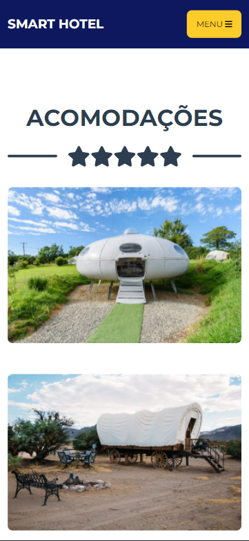
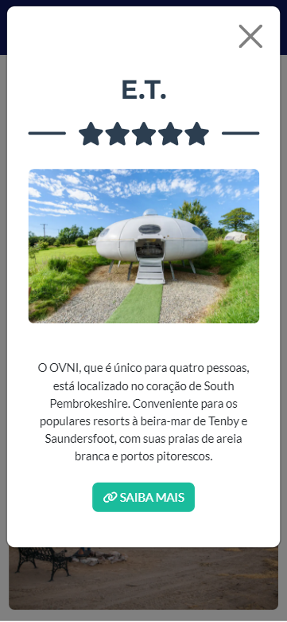
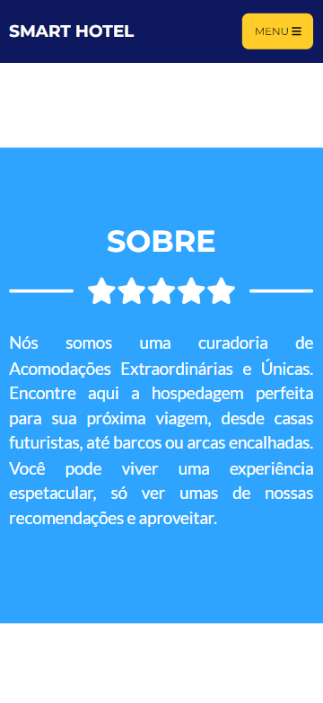
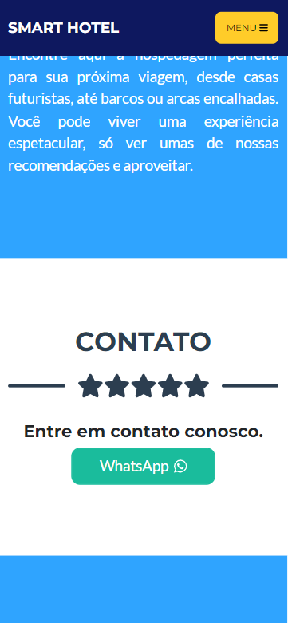
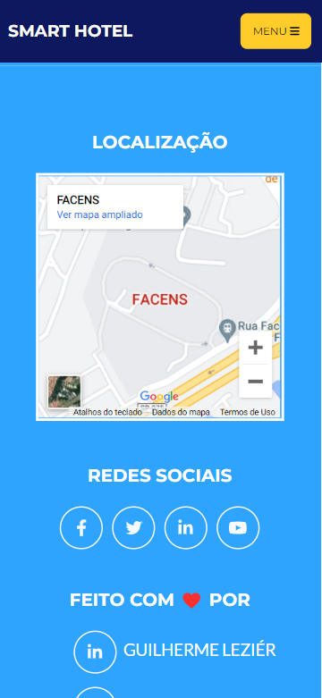
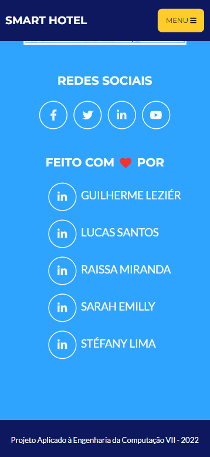

# :star2: SMART HOTEL :star2:

Um projeto acadêmico desenvolvido para disciplina de "PA - Projeto Aplicado à Engenharia de Computação VII" na Facens.

Sorocaba, São Paulo, Brasil.

<h2>:clipboard: Sumário</h2>
 - <strong><a href="#integrantes">Integrantes</a></strong>  
 - <strong><a href="#descricao">Descrição</a></strong>  
 - <strong><a href="#instalar">Como instalar</a></strong>  

<h2 id="integrantes">:student: Integrantes</h2>
<ul>
	<li><strong>Nome - RA - Disciplina Mobile - Disciplina PA</strong></li>
	<li><strong>Guilherme Leziér Gonçalves Saracura</strong> - 140894 - CL110TIN1 - PA038TIN1</li>
	<li><strong>Lucas Santos Rodrigues</strong> - 190727 - CP110TIN3 - PA038TIN3</li>
	<li><strong>Raissa Miranda de Lira</strong> - 190153 - CP110TIN3 - PA038TIN3</li>
	<li><strong>Sarah Emilly Sousa Cabral</strong> - 190332 - CP110TIN3 - PA038TIN3</li>
	<li><strong>Stefány Damasceno Lima</strong> - 190144 - CP110TIN3 - PA038TIN3</li>
</ul>

<h2 id="descricao">:pencil2: Descrição</h2>

O <strong><a href="https://smart-hotel-pa.herokuapp.com/">Smart Hotel</a></strong> é uma aplicação em desenvolvimento usando HTML, CSS e JS para o front-end e Node.js com Express.JS para o back-end. Ele usa o conceito de <strong><a href="https://web.dev/progressive-web-apps/">Progressive Web Apps</a></strong> onde o usuário pode baixar a aplicação no próprio dispositivo, como um aparelho Android ou Iphone. O próposito do serviço é ser um agregador de acomodações únicas e extraordinárias presentes ao redor do globo.

Na tela inicial, o usuário será recebido por uma mensagem de boas-vindas. Na aba de Acomodações, o usuário poderá ver todos os locais selecionados no momento. No Sobre poderá encontrar mais informações sobre o serviço. Em Contatos a pessoa poderá conversar com nós para poder tirar duvidas e conhecer mais.

<h3>:camera: Fotos</h3>

<h2 id="instalar">:pencil2: Como Instalar</h2>

Em um computador com <a href="https://git-scm.com/downloads">Git</a> e <a href="https://nodejs.org/en/">NPM/Node.js versão 16</a> ou mais recente instalado execute os seguintes passos:

 - No git bash execute o comando <code>git clone https://github.com/LuSrodri/PA-VII---Smart-Hotel.git</code>;  
 - Na raiz do projeto execute o comando <code>npm start</code>;  
 - Acesse <a href="localhost:3000">localhost:3000</a> e aproveite! :relaxed:
